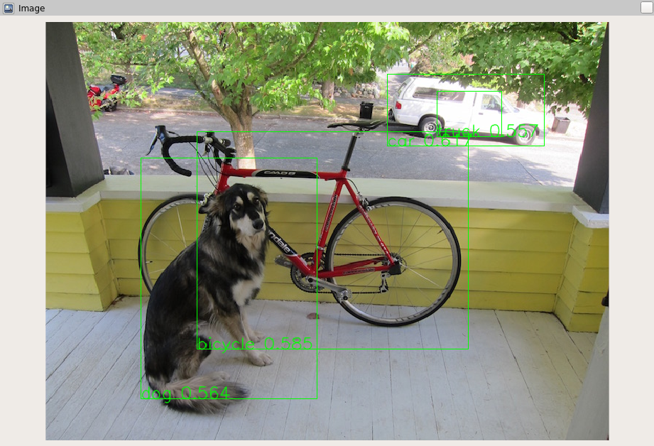

# Detection Visualizer

This package provides a ROS 2 node for visualizing computer vision detections.  This was taken from [detection_visualizer](https://github.com/ros2/detection_visualizer) and modified to work with our setup.

It subscribes to an image topic and a detections topic, and outputs an image with bounding boxes drawn on it.
The output topic can be visualized in rqt.

# Topics

* `/camera/image_raw` (Type `sensor_msgs/msg/Image`) - Input topic with images that have been given to a computer vision node
* `/camera/detections` (Type `bh_vision_msgs/msg/Vision`) - Input topic with detections on the given image
* `~/dbg_image` (Type `sensor_msgs/msg/Image`) - Output topic which has bounding boxes drawn on it