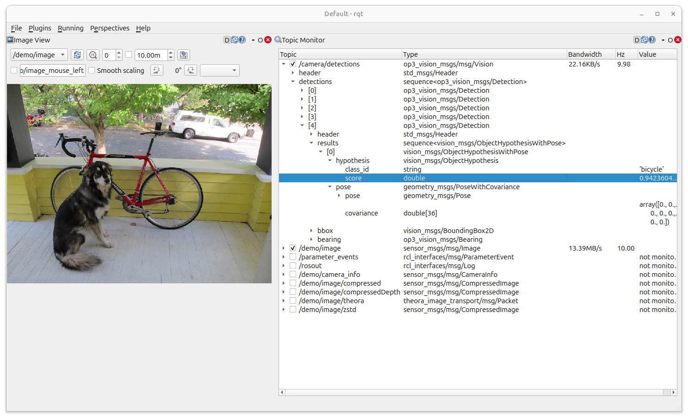
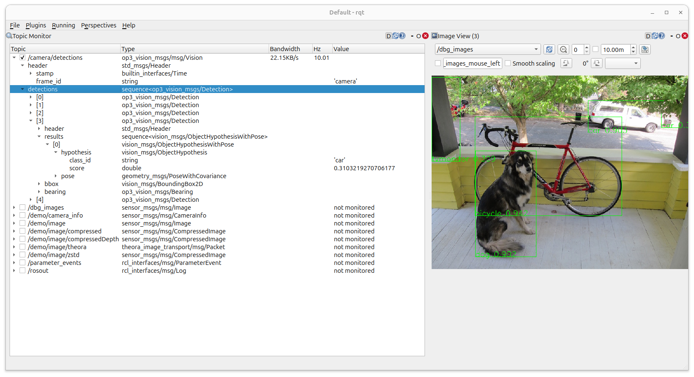

# Darknet Vision for ROS2

This repository contains code for detecting classes of objects in the camera feed of the
robot in simulation or on physical robots, including the detection visualisation and
vision messages to convey a bearing to each object detected.  

``` bash
op3-vision-darknet
├── assets
├── darknet
├── detection_visualizer
├── op3_vision_darknet
├── op3_vision_msgs
└── README.md

```

## Darknet

[Darknet](https://pjreddie.com/darknet) forms the basis of this vision system.  As such it is included in the code in this repo. 

## OP3 Vision Darknet

This is a **ROS 2 wrapper around [darknet](https://pjreddie.com/darknet)**, an open source neural network framework.  The code has been taken from [Open Robotics Darknet ROS](https://github.com/ros2/openrobotics_darknet_ros) and modified to work with the OP3 robots.

This is not a repository for training new weights, to do this follow the instructions in [darknet](https://pjreddie.com/darknet).  This repository soley uses pre-trained networks to make detections on images and publish these detections.


## Parameters
When running detections we can supply parameters for the weights, incoming image
topic and outgoing detections topic as shown in the example below.

* `detector_parameters` - This sets the parameter file which points to the weights files for the network.
* `rgb_image` - This sets the topic the raw image will come from default topic `/camera/image_raw`
* `detections` - This sets the topic to publish the detections to default = /camera/detections

```bash
ros2 launch op3_vision_darknet detector.launch.py rgb_image:=/demo/image detections:=/camera/detections

```

## Build Instructions

This package already includes darknet as part of the repository, so you do not need to fetch it separately. It will be built automatically when you build the package.

Build with:

```bash
colcon build --packages-up-to op3_vision_darknet --cmake-args -DENABLE_CUDA=OFF -DCMAKE_DISABLE_FIND_PACKAGE_OpenMP=TRUE
```

or (if you want to build everything):

```bash
colcon build --cmake-args -DENABLE_CUDA=OFF -DCMAKE_DISABLE_FIND_PACKAGE_OpenMP=TRUE
```

### Darknet configuration files:

Currently YOLO-V7 and YOLO-V7-tiny are configured but this configuration can be added to by following the stes below:

Create a new folder in the config folder with a custom name. In this folder add the following four files:
   1. `.names` file - this defines the names of the detections
   2. `.yaml` file - this is used by ros2 to find the necessary files to run the detector using the custom network
   3. `.cfg` file - this sets up the network
   4. `.weights` file - this is the network weights


## Running the Detector

Once the robot and OP3 manager are running, you can launch the detector:

```bash
ros2 launch op3_webots_ros2 robot_and_manager.launch.py
ros2 launch op3_vision_darknet detector.launch.py
```

You can override parameters, and run the launch file providing the path to the .yaml file as a parameter.

```bash
ros2 launch op3_vision_darknet detector.launch.py detector_parameters:=install/op3_vision_darknet/share/op3_vision_darknet/config/yolo-v7-tiny/params.yaml
```


---

## Detection Visualizer

The [detection\_visualizer](https://github.com/ros2/detection_visualizer) package provides a visualization node that overlays bounding boxes and labels directly on the image stream.


Since `detection_visualizer` is already part of this repository, you do not need to install it separately. It it a simple ROS2 package written in python.

##  Run the visualizer

The default topics for the incoming image and the detections are shown in the code
snippet below.

```python
        image_sub = message_filters.Subscriber(self, Image, '/camera/image_raw', qos_profile=qos_profile_sensor_data)
        detections_sub = message_filters.Subscriber(self, Vision, '/camera/detections', qos_profile=1)
```

If we want to use different topics, then we can remap the topics to match the required fields with ROS arguments as shown below.

``` bash

ros2 run detection_visualizer detection_visualizer \
  --ros-args \
  -r /camera/image_raw:=/demo/image \
  -r /camera/detections:=/camera/detections

```

Then view the output which combines the incoming image and bounding boxes and
publishes that to topic `dbg\_images`.

``` bash
ros2 run rqt_image_view rqt_image_view /dbg_images
```
---

## Adding Custom YOLO Configurations

Currently YOLO-v7 and YOLO-v7-tiny are configured.
You can add your own by following these steps:

1. Create a new folder in the `config/` directory.
2. Add the following files to that folder:

   * `.names` file – class names for detections.
   * `.yaml` file – ROS 2 parameter file pointing to the other files.
   * `.cfg` file – network configuration.
   * `.weights` file – trained weights.
3. Launch with your custom config, e.g.:

```bash
ros2 launch op3_vision_darknet detector.launch.py detector_parameters:=install/op3_vision_darknet/share/op3_vision_darknet/config/your_folder/params.yaml
```

# Testing with a Static Image

If you want to test detections without a camera, you can use the image\_publisher package to publish a test image. What we do in the next few steps is download a demo image, the use the ros image publisher package to publish this image to a topic `/demo/image/` as if it were a camera feed.

##  Install image\_publisher

```bash
sudo apt install ros-${ROS_DISTRO}-image-publisher
```

##  Publish a demo image

Download or provide a test image (for example, `config/dog.jpg`) and publish it:

```bash
wget https://raw.githubusercontent.com/pjreddie/darknet/master/data/dog.jpg -O dog.jpg

ros2 run image_publisher image_publisher_node dog.jpg --ros-args -r image_raw:=/demo/image

```

This publishes the image on the topic `/demo/image`. You can use the image visualiser
in rqt to test that this has worked.

```bash
ros2 run rqt_image_view rqt_image_view /demo/image
```


##  Run the detector with the demo image

In another terminal:

```bash
ros2 launch op3_vision_darknet detector.launch.py rgb_image:=/demo/image detections:=/camera/detections
ros2 topic echo /camera/detections
```
This will print out each detection message, showing the class ID, label, confidence score, and bounding box coordinates.
You should see logs indicating the network loaded successfully and that detections are being made.


## Visualising Detections with RQT

Open `RQT` to see both the input image and the published detections:




1. Select `/demo/image` to see the published input image.
2. Use Topic Monitor in `rqt` to view `/camera/detections`.
3. Detected objects will appear with class labels, bounding boxes, and confidence scores.

Or even simpler, just open rqt image view.

Open `rqt_image_view` and select:





